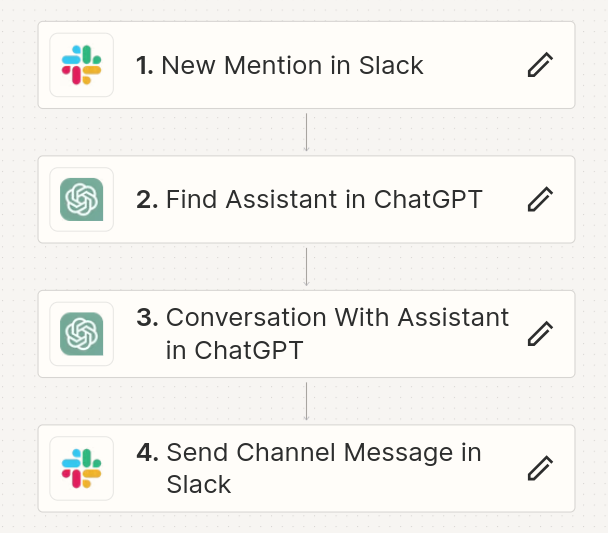
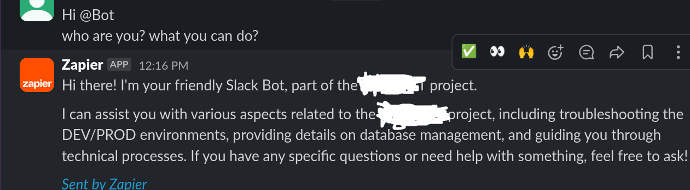

# Work with OpenAI API
## Assistants

### Setup OpenAI account
1. Create your account on [OpenAI](https://platform.openai.com/playground/).
2. Go to the [billing section](https://platform.openai.com/settings/organization/billing/overview) and add a payment method (the API won't work without it).
3. You will need to pay a minimum of $5 to start (info valid as of 06.2024).
4. Create a new project.
5. Create a new [API key](https://platform.openai.com/api-keys) for your project.
6. You can find information about limits and also set a monthly budget and notifications [here](https://platform.openai.com/settings/organization/limits).
7. Information about usage is available [here](https://platform.openai.com/usage).
8. Add information to the `.env.example` file and rename it to `.env`.

### Setup code
1. Use code in folder `AI_integrations` for add content for model learning from Confluence and Jira
2. Install libraries from `requirements.txt`
3. Create your assistant using `python ./OpenAI/assistants/create_assistant.py`. This will return an `assistant ID` and `Vector store ID` assigned to assistant.
4. Add (or update) assistant content using `python ./OpenAI/assistants/update_content.py <Vector store ID>`.
5. Delete assistant and all resources not used in another assistants: `python ./OpenAI/assistants/delete_assistant.py <assistant ID>`
6. Delete all files from OpenAI (if you download it manually): `python ./OpenAI/assistants/delete_all_files.py`
#### Legacy
1. Add (or update) your context using `python ./OpenAI/assistants_legacy/update_context.py <assistant ID>`.
2. Create a new thread (if required) using `python ./OpenAI//assistants_legacy/create_thread.py`.
3. Ask a question to the assistant using `python ./OpenAI//assistants_legacy/create_new_thread_with_existing_assistant.py <assistant ID> <thread_ID>`.
4. You can list your existing assistants using `python ./OpenAI//assistants_legacy/list.py`.

### Add integrations
#### Slack
I tested integration with Zapier, instructions [here](https://www.youtube.com/watch?v=kLkMC-ZIXq4).

Also, [PlugBear](https://plugbear.io/) can be used (not tested yet...).