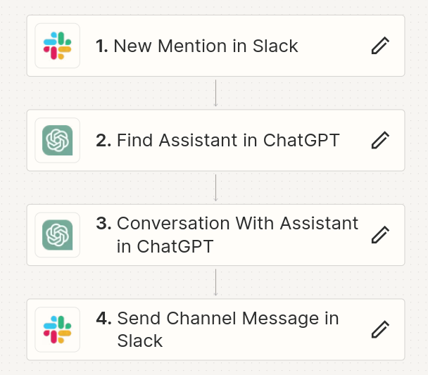
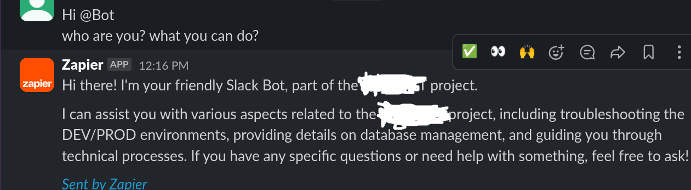

# Work with Open AI API
## Assistants

### Setup OpenAI account
1. Create your account in [OpenAI](https://platform.openai.com/playground/)
2. Go to [billing section](https://platform.openai.com/settings/organization/billing/overview) and add payment method (API woudn`t work without it)
3. You will need to pay as minimum 5$ to start (info valid for 06.2024)
4. Create new project.
5. Create new [API key](https://platform.openai.com/api-keys) for your project.
6. You can find info about Limits and also set monthly budget and notifications [here](https://platform.openai.com/settings/organization/limits)
7. Info about usage [here](https://platform.openai.com/usage)
8. add info to `.env.exapmle` and rename it as `.env` file

### Setup code
1. Create  `trainingData` folder and add files with context to this folder. [Supported files](https://platform.openai.com/docs/assistants/tools/file-search/supported-files)
2. Install `python3` and `openai` library.
3. Create your assistant using `python ./asistants/create_assistant_with_context.py` This will return `assistant ID`
4. Create new thread (if requiered) `python ./asistants/create_thread.py`
5. Ask question to assistant using `python ./asistants/create_new_thread_with_existing_assistant.py <assistant ID> <thread_ID>`
6. You can list your existing assistants using `python ./asistants/list.py`

### Add integrations
#### Slack
I test integration with Zapier, instructions [here](https://www.youtube.com/watch?v=kLkMC-ZIXq4)

Also [PlugBear](https://plugbear.io/) can be used. (not tested yet...)