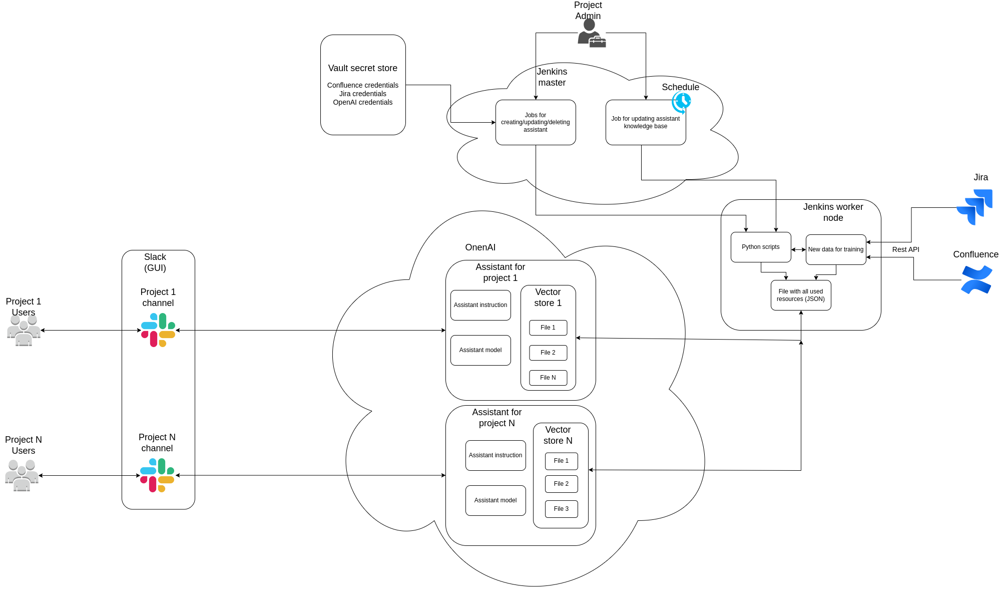

# AI Tool Examples Repository

This repository contains examples of working with different AI tools.

## Overview
The primary goal is to demonstrate how to upload our own files to an API for updating an AI knowledge base.

# OpenAI
### Running in Docker (only for OpenAI)

#### Start Docker Container

1. Create a `.env` file at `cp ./OpenAI/.env.example ./OpenAI/.env`
2. Build the Docker image: `docker build -t ai ./`.
3. Run the Docker container: `docker run -it -v ./:/AI ai bash`.  

Refer to the [OpenAI README](./OpenAI/Readme.md) for detailed instructions.

## Integrations (only for OpenAI)

`Here we have code for updating OpenAI assistant knowladge base from:`

### Jira
1. Create your own Jira API token.
2. Set Jira credentials in `./OpenAI/.env`.
3. Run `python ./AI_integrations/jira/main.py`.

### Confluence
1. Set Confluence credentials in `./OpenAI/.env`.
2. Run `python ./AI_integrations/confluence/main.py`.

## Data flow structure
`Jenkins is used on the diagram as an example of how to realize automatic deployment and updating of assistants.`  
`So far, within the framework of this project Jenkins setup is not planned..`


# Google Gemini (just a cursory glance)
Refer to the [Gemini README](./Gemini/Readme.md) for more information.

## Project Structure
```
├── AI_integrations
│   ├── confluence
│   └── jira
├── Gemini
│   └── .env
├── OpenAI
│   └── .env
├── Readme.md
└── trainingData
    └── jira
    │    ├── jira_SPACE-XXXX.json
    │    ...
    └── confluence
        ├── confluence_SPACE-docx-name.pdf
        ...
```